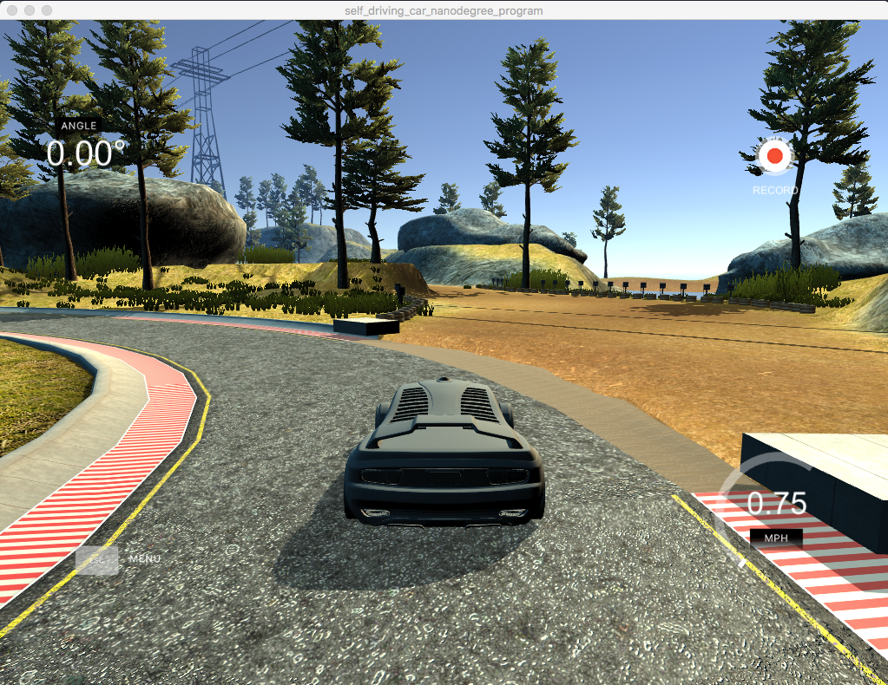
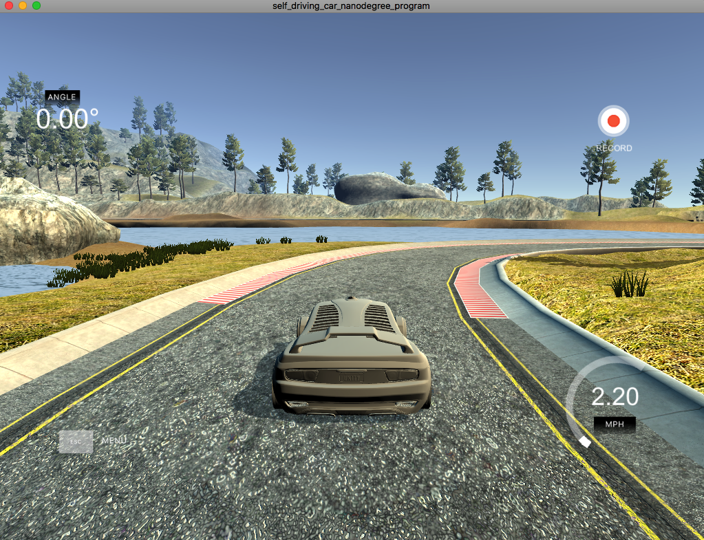

# Behavioral Cloning
---

**Behavioral Cloning Project**

The goals / steps of this project are the following:
* Use the simulator to collect data of good driving behavior
* Build a convolution neural network with Keras that predicts steering angles from images
* Train and validate the model with a training and validation set
* Test that the model successfully drives around track without leaving the road

## Rubric Points
### Here I will consider the [rubric points](https://review.udacity.com/#!/rubrics/432/view) individually and describe how I addressed each point in my implementation.  

---
### Files Submitted & Code Quality

#### 1. Submission includes all required files and can be used to run the simulator in autonomous mode

My project includes the following files:
* drive.py for driving the car in autonomous mode
* model.h5 containing a trained convolution neural network
* model.py containing the script to create and train the model
* writeup_report.md summarizing the results
* video.mp4 final output video generaed using video.py
* video2.mp4 final output video that is generated by screen-recording


#### 2. Submission includes functional code
Using the (simulator developed by the Udacity team)[https://github.com/udacity/self-driving-car-sim] and my drive.py file, the car can be driven autonomously around the track by executing
```sh
python drive.py model.h5
```
Also make sure to open up the Udacity simulator and select the AUTONOMOUS MODE.
#### 3. Submission code is usable and readable

The model.py file contains the code for training and saving the convolution neural network. The file shows the pipeline I used for training and validating the model, and it contains comments to explain how the code works.

### Model Architecture and Training Strategy

#### 1. An appropriate model architecture has been employed

I used a modified version of a [convolutional neural network developed by NVIDIA](https://devblogs.nvidia.com/parallelforall/deep-learning-self-driving-cars/).


| Layers   |      Where in model.py     |
|----------|:-------------:|
| Batch Normalization layer | line 123 |
| Convolutional |    line 124   |
| Dropout | line 125 |   
| Convolutional |    line 126   |
| Dropout | line 127 |   
| Convolutional |    line 128   |
| Dropout | line 129 |   
| Convolutional |   line 130    |
| Dropout | line 131 |   
| Convolutional |   line 132    |
| |
| Dropout | line 133 |
| Flatten | line 135 |
| Dropout | line 136 |
| Fully Connected | line 137 |   
| Fully Connected | line 138 |   
| Fully Connected | line 139 |   
| Dropout | line 140 |   

#### 2. Attempts to reduce overfitting in the model

As can be seen from the above table, the model contains several dropout layers to reduce overfitting.
The model was trained and validated on different data sets to ensure that the model was not overfitting (model.py line 147). The model was tested by running it through the simulator and ensuring that the vehicle could stay on the track.

#### 3. Model parameter tuning

The model used an adam optimizer, so the learning rate was not tuned manually (model.py line 145).

#### 4. Appropriate training data

Training data was majorly composed of the one provided by Udacity.  
After training and testing out the neural network with the given model, several sections of the track where the vehicle drove off road were recorded.  
Then, I additional training data were added (recovery data) to ensure that the car stays on track. The additional data include the vehicle driving back on track from the peripheries of the roads, and making sharp turns towards the track where the vehicle completely drove off road.

For details about how I created the training data, see the next section.

### Model Architecture and Training Strategy

#### 1. Solution Design Approach

The overall strategy for deriving a model architecture was to start off with the model developed by NVIDIA and add more layers to fasten the learning process. As can be found in [this article](https://devblogs.nvidia.com/parallelforall/deep-learning-self-driving-cars/), the model has a proven history of performing well on self-driving cars. After reading several discussions on the Udacity Forum, several dropout layers were added to the original NVIDIA model to both avoid overfitting and fasten the training time.

Training images were prepared in the following manner:
1. Center, left, and right images were recorded
2. For the left and right images, corresponding steering angles were corrected for better precision
3. Top and bottom sections of images that were not crucial for the training were cropped out
4. The training simulator track mainly composed of the vehicle making left turns. To avoid the right-turn bias, images and corresponding steering anlges were flipped.
5. Images were resized to smaller dimensions to fasten the training process.
6. Color channel were changed to YUV to reflect the color channel used in the [NVIDIA article](https://devblogs.nvidia.com/parallelforall/deep-learning-self-driving-cars/)

The final step was to run the simulator to see how well the car was driving around track one. There were a few spots where the vehicle fell off the track. Two most troubling sections are shown below.




In order to "teach" the vehicle how to behave in the troubling sections, more driving samples were added by repeatedly running the simulator and recording the driving behaviors in the sections of interest.

At the end of the process, the vehicle was able to drive autonomously around the track without leaving the road.

#### 2. Final Model Architecture

Below is a visualization of the final model architecture (model.py lines 122-141)  
| Layer         		|     Description	        					|
|:-----------------:|:---------------------------------:|
| Input         		| 64x64x3 YUV image   							|
| Convolution 5x5  	| 1x1 stride, same padding         	|
| ELU				       	|									             			|
| Dropout   	   		|						             						|
| Convolution 5x5  	| 1x1 stride, same padding         	|
| ELU					      |								             				|
| Dropout   		  	|					             							|
| Convolution 5x5  	| 1x1 stride, same padding         	|
| ELU				       	|									             			|
| Dropout   		  	|					             							|
| Convolution 5x5  	| 1x1 stride, same padding         	|
| ELU				       	|							             					|
| Dropout   		  	|						            						|
| Convolution 5x5   | 1x1 stride, same padding         	|
| ELU					      |								             				|
| Dropout   		  	|								            				|
|                   |                                   |
| Flattening       	|                              			|
|                   |                           				|
| Dropout   			  |							             					|
| Fully connected		|                  				    			|
| Fully connected		|                  				    			|
| Fully connected		|                  				    			|
| Dropout   			  |							            					|
|                   |                            				|
| Output				    |                                   |

#### 3. Creation of the Training Set & Training Process

The training data was records of a vehicle driving closely to the center of the road:


I then recorded the vehicle recovering from the peripheries of the track, as well as making sharp turns toward the track at the troubling regions:


As adding these data significanly improved the vehicle driving on the track, I added more recovery data as soon as I spotted a region where the vehicle drove off track.

The acquired the data went through the preprocessing mentioned in the previous section (section 1).

I data were finally randomly shuffled and split into training and validation sets with the training size being 80% of the data set and the rest validation.

I used this training data for training the model. The validation set helped keep track of the training performance. After reviewing posts on Udacity Forum, five epochs were used to avoid overfitting the data. I used an adam optimizer so that manually training the learning rate wasn't necessary.

#### 4. Finaly output
With the successfully trained model, vehicle perfectly followed the track as can be seen from the below YouTube link:
[**Final Output Youtube Video**](https://www.youtube.com/watch?v=2C4R3JE7Czc)
